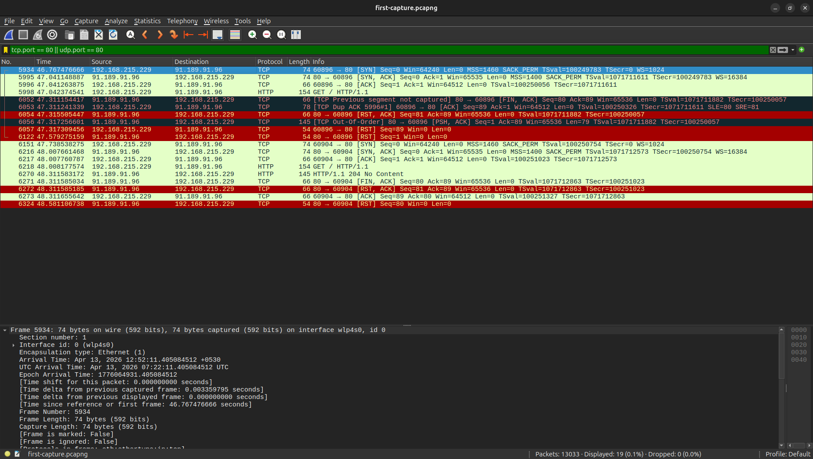

# Wireshark Traffic Analysis

### A detailed analysis of real network traffic covering five core 
### networking protocols

---

## 📋 Project Overview

This project captures and analyzes real network traffic using Wireshark
on a home network. Five protocols are examined in detail — TCP, DNS,
ARP, ICMP, and HTTP — with each capture documented in a full analysis
report explaining what each packet means and why it matters.

All captures were performed on a personally owned home network.
No third party networks were involved.

---

## 🔍 Protocols Analyzed

| Protocol | Capture File | Key Concept Demonstrated |
|---|---|---|
| TCP | tcp-handshake.pcapng | Three way handshake and sequence numbers |
| DNS | dns-capture.pcapng | Query/response cycle and load balancing |
| ARP | arp-capture.pcapng | MAC resolution and broadcast nature |
| ICMP | icmp-capture.pcapng | Echo request/reply and TTL analysis |
| HTTP | http-capture.pcapng | Plain text transmission and security implications |

---

## 📄 Full Analysis Report

The complete packet by packet analysis with screenshots and findings
is documented in [report.md](report.md).

---

## 🛠️ Tools Used

- Wireshark — packet capture and analysis
- curl — HTTP request generation
- nslookup — DNS query generation
- ping — ICMP traffic generation

---

## 📊 Key Findings

**TCP** — Captured the full three way handshake between my laptop and
example.com. Sequence numbers confirmed the synchronization process
that guarantees reliable delivery.

**DNS** — Queried four domains. Google returned multiple IP addresses
demonstrating DNS load balancing across their global infrastructure.

**ARP** — Captured the router MAC address resolution process. The
broadcast nature of ARP requests confirms why ARP spoofing is a
viable attack vector on local networks.

**ICMP** — Pinged 8.8.8.8 and received TTL 117 in replies, indicating
approximately 11 router hops between my network and Google's servers
in Sri Lanka.

**HTTP** — Full HTML content of example.com was visible in plain text
inside captured packets, demonstrating the security risk of
unencrypted HTTP traffic on shared networks.

---

## ⚠️ Legal Notice

All traffic captures were performed exclusively on a personally owned
home network. No third party or public networks were captured or
analyzed.

---

## 🧠 What I Learned

- How to use Wireshark filters to isolate specific protocol traffic
- How TCP sequence numbers work during connection establishment
- How DNS resolves domain names before any connection is made
- How ARP operates at Layer 2 to resolve MAC addresses
- How ICMP TTL values reveal network topology information
- Why HTTP is insecure and how packet capture demonstrates this visually

---

## 📁 Repository Structure

| Path | Contents |
|---|---|
| `report.md` | Full protocol analysis with packet details |
| `captures/` | Raw .pcapng capture files for each protocol |
| `screenshots/` | Wireshark screenshots from each analysis |

---

*All captures performed on Ubuntu Linux using Wireshark*
