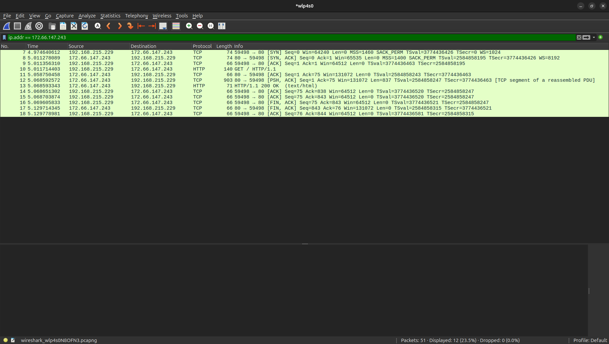
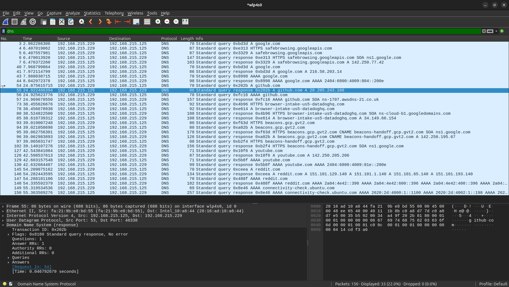
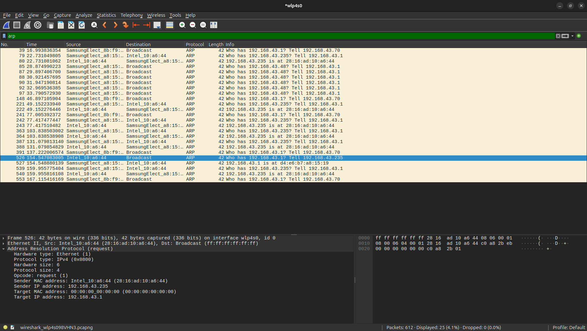
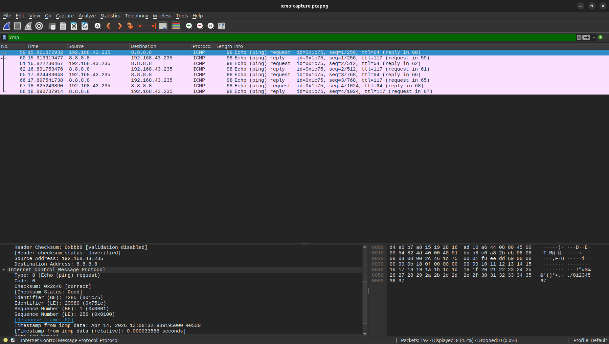
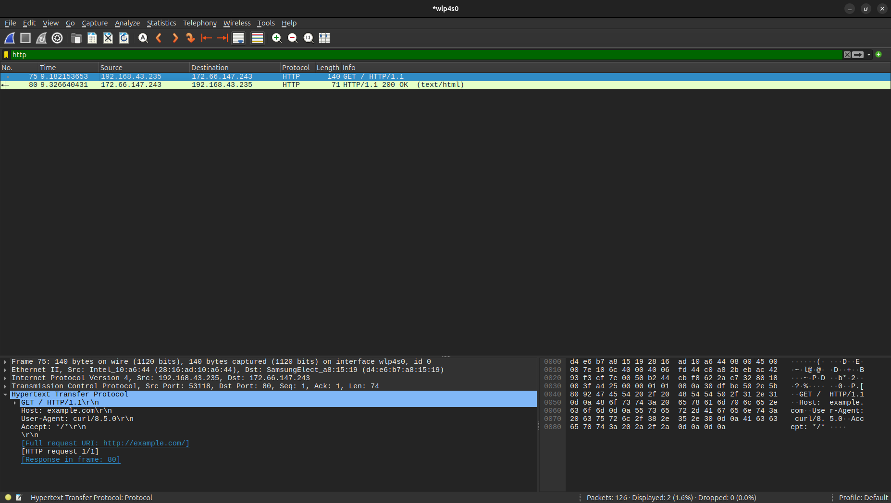
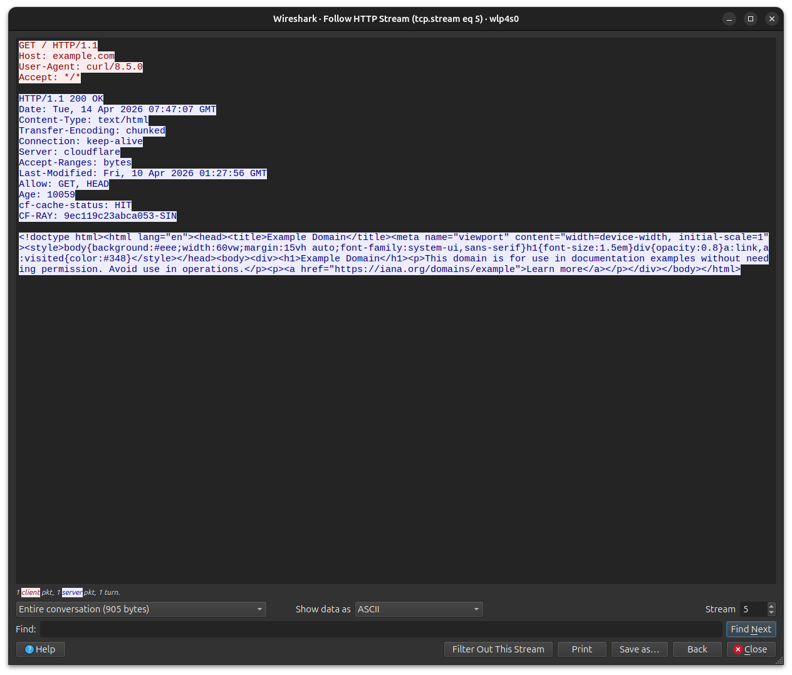

# Network Traffic Analysis Report
### Captured and analyzed using Wireshark on Ubuntu Linux

---

## Section 1 — TCP Three Way Handshake

### What is the TCP three way handshake?
The TCP three way handshake is the process by which a reliable connection
is established between two hosts before any data is exchanged. It consists
of three packets — SYN, SYN-ACK, and ACK.

### Capture details
- **Target:** example.com ()
- **Protocol:** HTTP (port 80)
- **Tool used:** curl http://example.com

### Packet analysis

**Packet 1 — SYN**
- Source: 192.168.215.229:59498
- Destination: 172.66.147.243:80
- Sequence number: 1853547140
- Flags: SYN=1, ACK=0
- Meaning: My laptop initiates a connection request to example.com

**Packet 2 — SYN-ACK**
- Source: 172.66.147.243:80
- Destination: 192.168.215.229:59498
- Sequence number: 3816164269
- Acknowledgment number: 1853547141
- Flags: SYN=1, ACK=1
- Meaning: Server acknowledges the request and sends its own sync signal

**Packet 3 — ACK**
- Source: 192.168.215.229:59498
- Destination: 172.66.147.243:80
- Acknowledgment number: 3816164270
- Flags: SYN=0, ACK=1
- Meaning: My laptop acknowledges the server's sync — connection established

### Why this matters
Without this handshake TCP cannot guarantee reliable delivery. The sequence
numbers established here are used for the rest of the connection to track
which packets have been received and which need to be retransmitted.

### Screenshot

---

## Section 2 — DNS Traffic Analysis

### What is DNS?
DNS translates human readable domain names into IP addresses. Every
connection to a hostname triggers a DNS query before the actual
connection is made.

### Capture details
- **Tool used:** nslookup
- **Domains queried:** google.com, github.com, youtube.com, reddit.com

### Packet analysis — google.com query

**DNS Query**
- Transaction ID: 0x202b
- Type: A (IPv4 address request)
- Name: github.com

**DNS Response**
- Transaction ID: 0x202b
- IP addresses returned: 20.205.243.166
- TTL: 0 seconds

### Key observation
DNS returns multiple IP addresses for google.com. This is DNS load
balancing — Google distributes traffic across multiple servers globally
so no single server gets overwhelmed.

### Screenshot

---

## Section 3 — ARP Traffic Analysis

### What is ARP?
ARP resolves IP addresses to MAC addresses on the local network. Before
your laptop can send a packet to any device on the same subnet it must
know that device's MAC address.

### Capture details
- **Target:** Default gateway 192.168.43.1
- **Method:** Cleared ARP cache then pinged gateway

### Packet analysis

**ARP Request (broadcast)**
- Sender MAC: 28:16:ad:10:a6:44
- Sender IP: 192.168.43.235
- Target MAC: 00:00:00:00:00:00 (unknown)
- Target IP: 192.168.43.1
- Info: Who has 192.168.43.1? Tell 192.168.43.235

**ARP Reply (unicast)**
- Sender MAC: d4:e6:b7:a8:15:19
- Sender IP: 192.168.43.1
- Info: 192.168.43.1 is at d4:e6:b7:a8:15:19

### Key observation
ARP requests are sent as broadcasts — every device on the network
receives them. Only the device with the matching IP replies. This
broadcast nature of ARP is what makes ARP spoofing attacks possible —
a malicious device can send fake ARP replies to redirect traffic.

### Screenshot

---

## Section 4 — ICMP Traffic Analysis

### What is ICMP?
ICMP is used for network diagnostics and error reporting. The ping
command uses ICMP Echo Request and Echo Reply messages to test
connectivity and measure round trip time.

### Capture details
- **Target:** 8.8.8.8 (Google DNS)
- **Packets sent:** 4 pings

### Packet analysis

**ICMP Echo Request**
- Type: 8 (Echo Request)
- Code: 0
- Identifier: 7285 (ox1C75)
- Sequence number: 1 (0x0001)
- TTL: 64

**ICMP Echo Reply**
- Type: 0 (Echo Reply)
- Code: 0
- Identifier: 7285 (ox1C75)
- Sequence number: 1 (0x0001)
- TTL received: 117

### Key observation
The TTL value in Google's reply was 117. Since Linux systems
typically start with TTL 128, this means the packet traversed
approximately 11 routers between Google's
server and my laptop.

### Screenshot

---

## Section 5 — HTTP Traffic Analysis

### What is HTTP?
HTTP is the protocol used to transfer web content. Unlike HTTPS it
transmits all data in plain text making it visible to anyone capturing
traffic on the same network.

### Capture details
- **Target:** example.com
- **Tool used:** curl -v http://example.com

### Packet analysis

**HTTP GET Request**
- Method: GET
- URI: http://example.com/
- Host: example.com
- User-Agent: curl/8.5.0

**HTTP Response**
- Status code: 200 OK
- Content-Type: text/html
- Content-Length: 528 bytes
- Server: Cloudflare

### Security observation
The full HTML content of example.com was visible in plain text inside
the captured packets. Any device on the same network running a packet
capture tool could read this content without any special privileges.
This demonstrates why HTTPS is essential — it encrypts the content so
even if traffic is captured the data is unreadable without the
encryption keys.

### Screenshot

